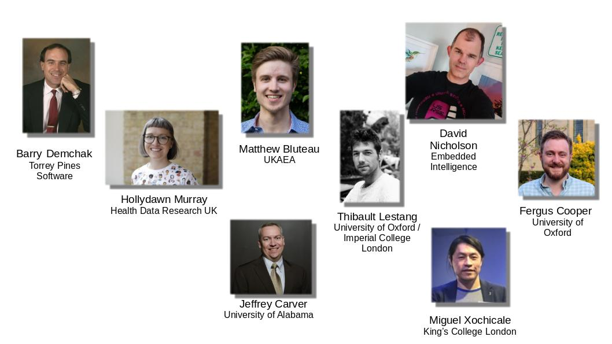
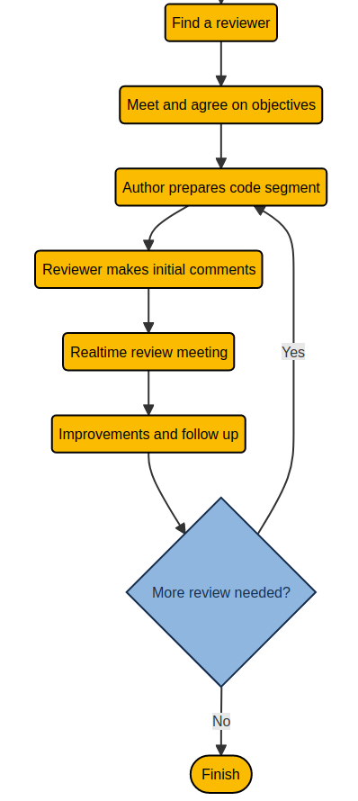

<!--
_class:
 - lead
 - invert
-->

# Code Review During Research: A Community Effort Towards Guidelines

Matthew Bluteau, UKAEA
on behalf of the RCRC

---

## Code reviews at the time of publication

* What about code quality?

<!--

- CODECHECK does code review at the time of publication. It's relevant for
  reproducibility and checking state of a codebase.
- But what if the code is unreadable/unmaintanable? It's too late for
  a rewrite.

-->

---

## Code review *during research*

<!--

- There is a need for code review /during research/. 
- A different kind of code review: informal, low-stakes and frequent. Something you
  would with colleagues once a week.
- Focus on code quality. Does not replace publication-time review -
  but is complementary.

-->

---

## Code review benefits researchers themselves

* Learning and knowledge transfer
  - Dissemination of good practices.
  - Continuous peer learning.
* Collaboration
  - Group awareness, cohesion and trust
  - Makes it easier for people to join a team... and leave it.

<!--

- Code review during research has benefits beyond better code quality.

- Learning and knowledge transfer
  + Mentoring and dissemination of experience and good practices.
  + More experienced programmers are exposed to new patterns and
    approaches.
  + Good example: group of students at Imperial College London who started doing
  code review sessions with Thibault and as a result set up a framework for
  handling inputs to their codes 

- Collaboration
  + Regular meetings and discussions increases group awareness, trust
    and cohesion.
  + Specific technical knowledge is spread. Easier for newcomers,
    reduce impact of leavers.

-->

---

## Code review is common software practice...

... in the software industry and open source communities.

Code review is very rare in academia and *most* research domains.

* Lack of awareness
* Lack of guidance
* Lack of incentives
* Lack of confidence

<!--

- Code review is common in the software industry and open source
  communities, but very rare in research.

- Lack of awareness and guidance on how to do code review in a
  research context. Most material out there is targeted at the
  software industry and open source projects.

- Establishment of code review culture will probably struggle with
  lack of incentives for code quality and lack of confidence.

- Target the first two points for the most immediate impact

-->

---

#### Research Code Review Community Group 2 (Code Review During Research)

<!--

- UK/US based group of researchers and RSEs.

- Started as one of the working groups of the Code Review Community.

- There were other groups in the community, e.g. code review at publication, EDI considerations for code review, stakeholders and policy, etc
  - Unfortunately, these lost momentum and never produced anything concrete

- In practice, guidelines as website. Living document that is open to
  contributions.

-->

---

## Guidelines as a [website][dev-review]

<iframe src="https://dev-review.readthedocs.io/en/latest/" width="100%" height="85%"></iframe>

[dev-review]: https://dev-review.readthedocs.io/en/latest/

---

## Code review guidelines I

Principles

* Suited for "lone coder"
* Short, and predictable time commitment
* Informal and low stakes
* Accessible to beginner programmers

<!--

- Suited for lone, perhaps isolated, research developpers.

- Short, fixed duration. Can fit into a busy schedule with possibility
  of iteration.

- Informal and low stakes.

- Accessible to less experienced programmers (e.g. resaercher how
  would not think of themselves as programmers).

-->

---

## Code review guidelines II

The four steps:

1) Find a reviewer
2) Meet and agree on objectives
3) Perform code review
4) Finalise

---

## Find a Reviewer

There is no code review without a reviewer or reviewers. The good news is, almost any researcher who codes is a good candidate for being one.

Potential reviewers are not far: in your own research group, others
you collaborate with, or your local Research Software Engineering
group. They can also be found in communities outside your institution
or specific research domain.

---

## Meet and Agree Objectives

A code review can improve code in a lot of different ways, but trying to do everything at once is rarely effective. Make it clear to all people involved why they are are pariticpating.

Key questions to collectively answer are:
* What is the author expecting from the review?
* What should the review enable? Better readability? Knowledge
  transfer? Better performance?
* What part of the code should we look at?

---

## Perform the Review

5 steps:

* Code author communicates the code and its context to reviewer(s) in advance.
* Reviewer(s) review code in light of objectives and areas of focus, agreed upon during the "Meet and Agree Objectives"
* Author and reviewer(s) meet in real time and discuss the code.
* Code author implements changes.
* Rinse and repeat.

---

## A Note on Communication

*Although the subject is technical, everyone involved must remember that they are interacting with humans. Empathy, humbleness and non-confrontational communication are key to a successful code review.*

<!--
- This applies to all stages, but particularly when meeting to discuss the code in person (or leaving an asynchronous comment)
-->

---

<!--
_class:
 - lead
 - invert
-->

## Questions?

:bird: @mattasdata
:elephant: @mattasdata@qoto.org
